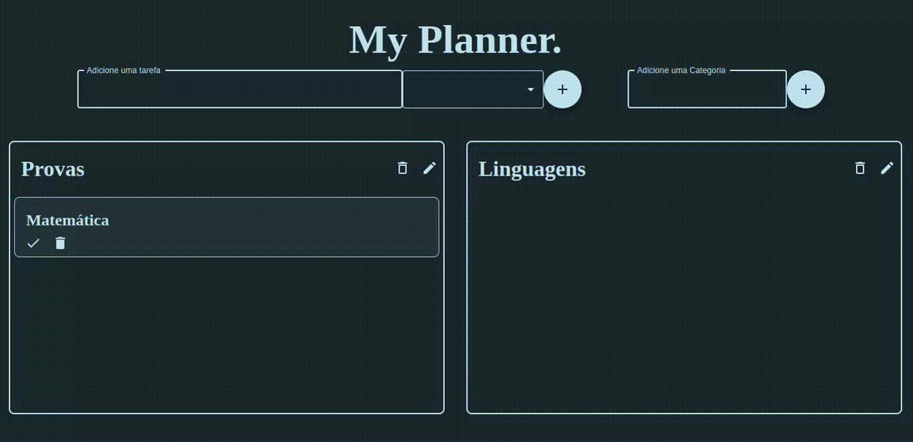

# MyPlanner

Este projeto é uma página Web construída em React.js que utiliza conceitos de preenchimento de formulários, renderização condicional e requisições HTTP para prover ao usuário uma solução virtual de gerenciamento de tarefas pessoais hospedada em nuvem.

A página pode ser acessada através da URL: https://my-planner.onrender.com ou iniciada localmente(Veja a Seção "Rodando Localmente")

A API que conecta o projeto ao Backend pode ser acessada através da URL: https://planner-api-cosp.onrender.com e seu código está disponível em: https://github.com/Caique27/Planner-API/

## Stack utilizada


## Rodando localmente

Clone o projeto

```bash
  git clone https://github.com/Caique27/My-Planner.git
```

Entre no diretório do projeto

```bash
  cd My-Planner
```

Instale as dependências

```bash
  npm install
```

Inicie a aplicação

```bash
  npm start
```

Acesse através da URL:

```bash
  https://localhost:3000/
```

## Demonstração da aplicação



## Funcionalidades

-   Criar e apagar tarefas e categorias de maneira intuitiva através de formulários
-   Renomear Categorias
-   Marcar tarefas como feitas
-   Hospedagem virtual que dispensa instalação para acessar os recursos da aplicação

## Contato

Pesquise pelo nome de usuário ou clique nos ícones.

[](https://github.com/Caique27)
[](https://www.linkedin.com/in/caique-alves-/)

